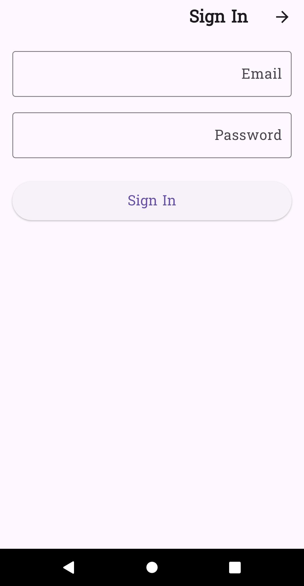
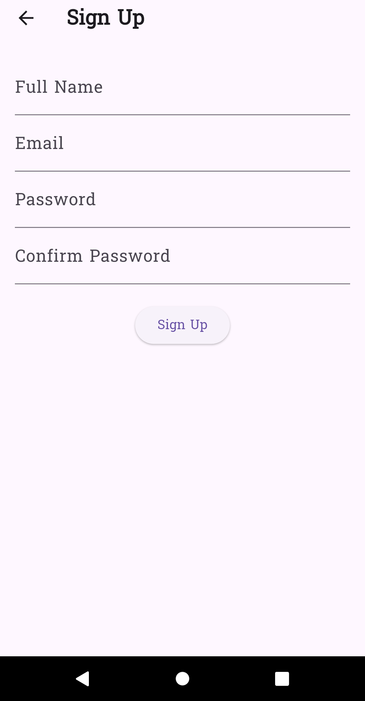
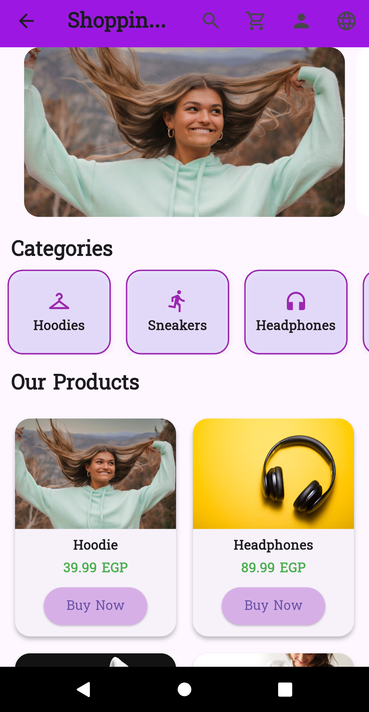
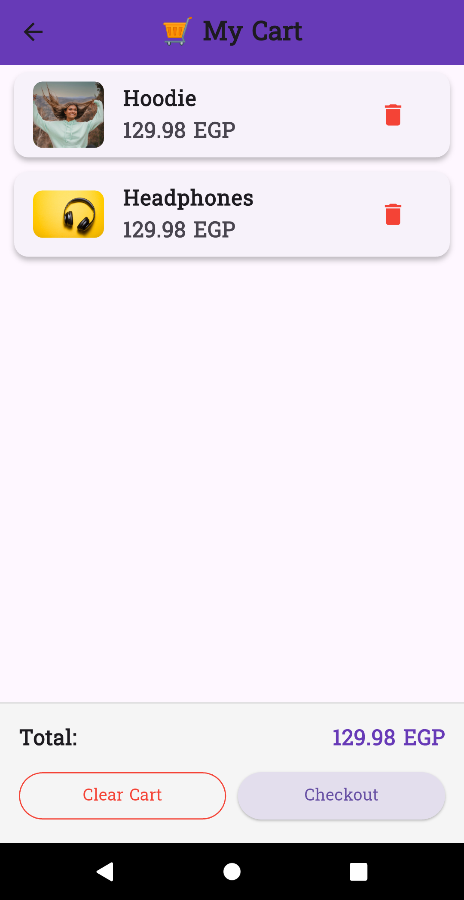
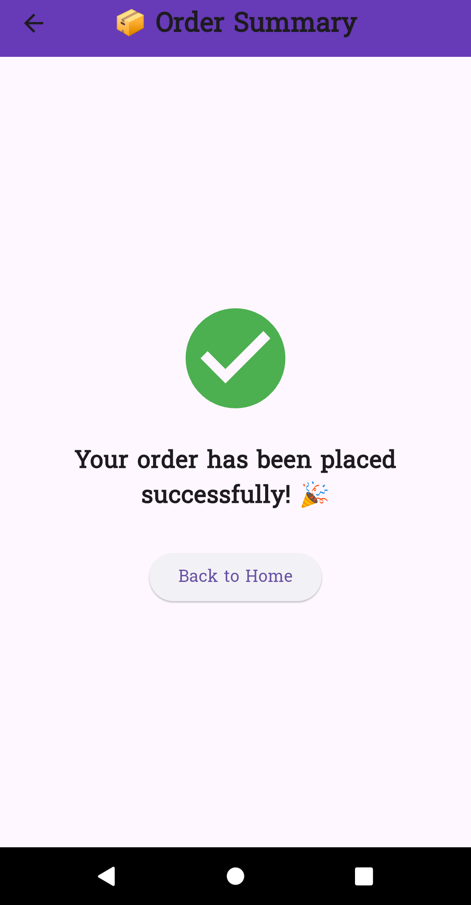

# Shopping App

A simple shopping application built with **Flutter**.  
The app demonstrates core e-commerce features such as browsing products, viewing categories, managing a cart, and checkout.

---

## Features
- **Welcome Screen** → App intro with logo and navigation to Sign In / Sign Up.  
- **Home Screen** → Shows featured slider, categories, products, and hot offers.  
- **Category Screen** → Displays products filtered by category.  
- **Cart Screen** → Add/Remove products and view total price in EGP.  
- **Checkout** → Simple confirmation for order placement.  
- **Profile Screen** → Basic user profile.  
- **Localization Ready** → English & Arabic language switch.  

---

## Screenshots
Add screenshots of your app here:  

- Welcome Screen  
- Home Screen  
- Category Screen  
- Cart Screen  
- Checkout  

## Screenshots  

### Welcome Screen


### Signin Screen


### Signup Screen


### Home Screen


### Cart Screen


### Profile Screen


### Order Screen


---

## Setup Instructions
1. Clone the repository:
   ```bash
   git clone https://github.com/shahdshaker/shopping_app.git
   ```
2. Navigate to the project:
   ```bash
   cd shopping_app
   ```
3. Install dependencies:
   ```bash
   flutter pub get
   ```
4. Run the app:
   ```bash
   flutter run
   ```

---

## 📂 Project Structure
```
lib/
 ┣ screens/       # App screens (Welcome, Home, Cart, Profile, etc.)
 ┣ widgets/       # Reusable widgets (ProductCard, FeaturedSlider, etc.)
 ┣ providers/     # State management (CartProvider, etc.)
 ┣ data/          # Dummy products data
 ┣ routes.dart    # App routes
 ┗ main.dart      # Entry point
```
